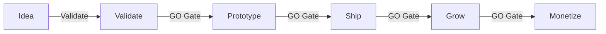
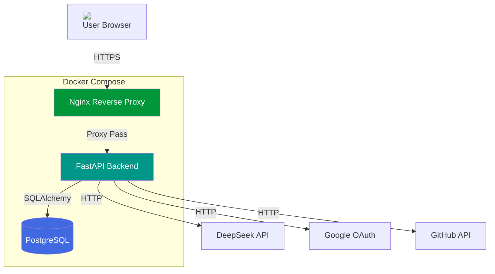

<p align="center">
  
</p>

<p align="center">
  <a href="https://github.com/yaolinhui/sparkbin/actions"></a>
  <a href="./LICENSE"></a>
  <a href="./SELF_HOSTING.md"></a>
  <a href="https://sparkbin.wanchun.me"></a>
  <br/>
  
  
  
  
</p>

<p align="center">
  <b>An AI-native project coach for indie hackers and vibe coders.</b><br/>
  Validate before you build. From idea to monetization in 6 structured stages.
</p>

<p align="center">
  <a href="https://sparkbin.wanchun.me"><b>Live Demo</b></a> ·
  <a href="./SELF_HOSTING.md">Self-Hosting Guide</a> ·
  <a href="./CONTRIBUTING.md">Contributing</a>
</p>

---

<!-- 核心演示动图 -->
<p align="center">
  
</p>

> <i><sub>演示动图需录制补充，参见 <a href="docs/assets/recording-guide.md">录制指南</a></sub></i>

## Why SparkBin?

> Most projects die because nobody wants them.

SparkBin forces you to **validate your idea through 6 structured stages** before writing production code. Each stage has AI-powered coaching, GO/NO-GO decision gates, and actionable deliverables.



## Features

| Feature | Description |
|---------|-------------|
| **6-Stage Framework** | Idea → Validate → Prototype → Ship → Grow → Monetize. GO/NO-GO gates prevent building the wrong thing. |
| **AI Project Coach** | DeepSeek-powered AI chat with streaming responses. Coaches you through each stage with context-aware suggestions. |
| **Pixel Pet Companion** | Animated pixel-art AI pet (10 types, 4 personalities) that reacts to your progress and coaches you along the way. |
| **Structured Validation** | Kanban-style validation board with surveys, interviews, community posts, and competitor analysis tools. |
| **Multi-Platform Launch** | Auto-generate marketing copy for Xiaohongshu, Twitter, ProductHunt, V2EX, Jike, and more. |
| **Monetization Playground** | Design pricing tiers, simulate Stripe checkout flows, track MRR and conversion funnels. |
| **GitHub Import** | Connect GitHub, select a repo, and let AI analyze the README to suggest the right stage and pre-fill project fields. |
| **Local AI (Ollama)** | Run AI completely offline with llama3.2, qwen2.5, or any Ollama-compatible model. No API keys needed. |
| **Multi-Auth** | Local JWT + Google OAuth + GitHub OAuth + email registration with verification and honeypot anti-bot protection. |
| **7 Languages** | Chinese, Japanese, Korean, Spanish, French, German, English with i18n support. |
| **Brutalist UI** | Zero border-radius, high contrast, JetBrains Mono typography. Dark/Light theme with system preference detection. |

## Quick Start

### Docker (Recommended)

```bash
git clone https://github.com/yaolinhui/sparkbin.git
cd sparkbin
cp .env.example .env
# Edit .env: set SECRET_KEY, ENCRYPTION_KEY, DEFAULT_PASSWORD
docker compose up -d
# Open http://localhost
# Login: admin / your-DEFAULT_PASSWORD
```

See [SELF_HOSTING.md](./SELF_HOSTING.md) for manual setup, production deployment, and Ollama local AI configuration.

## Screenshots

<!-- 六阶段截图网格 -->
<p align="center">
  
  
</p>
<p align="center">
  <i>Idea & Validate Stages — 截图待补充，参见 <a href="docs/assets/recording-guide.md">录制指南</a></i>
</p>

<p align="center">
  
  
</p>
<p align="center">
  <i>Prototype & Ship Stages — 截图待补充</i>
</p>

## Architecture



## Tech Stack

| Layer | Technology |
|-------|------------|
| **Frontend** | React 18, Vite, TypeScript, Tailwind CSS, Zustand |
| **Backend** | Python 3.11, FastAPI, SQLAlchemy 2.0, Alembic |
| **Database** | PostgreSQL (production) / SQLite (development) |
| **AI** | DeepSeek, Kimi, Doubao, OpenAI, Ollama (unified proxy) |
| **Auth** | JWT with refresh token rotation, bcrypt, rate limiting, honeypot |
| **Payments** | Stripe Test Mode (optional) |
| **Email** | Resend (optional) |
| **i18n** | 7 languages with localStorage persistence |
| **Deploy** | Docker, Docker Compose, Nginx |

## AI Chat Demo

<p align="center">
  
</p>

> <i><sub>AI 聊天演示动图需录制补充，参见 <a href="docs/assets/recording-guide.md">录制指南</a></sub></i>

## Roadmap

- [x] 6-stage project framework
- [x] AI chat with streaming
- [x] Pixel Pet companion
- [x] Multi-auth (JWT, Google, GitHub, Email)
- [x] GitHub project import
- [x] Local AI (Ollama)
- [x] i18n (7 languages)
- [x] Stripe payment simulation
- [ ] Mobile App (React Native)
- [ ] Team collaboration
- [ ] Public project gallery

## Contributing

We welcome contributions! See [CONTRIBUTING.md](./CONTRIBUTING.md) for guidelines.

## Security

See [SECURITY.md](./SECURITY.md) for vulnerability reporting and security best practices.

## License

[Elastic License 2.0](./LICENSE)

You are free to use, modify, and self-host SparkBin. The Elastic License prevents cloud providers from offering SparkBin as a managed service without permission, protecting the project's sustainability while keeping it open for individual developers and small teams.
